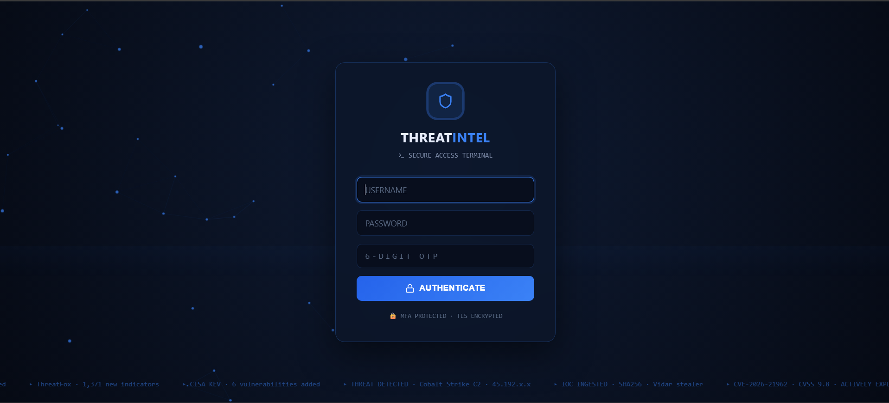
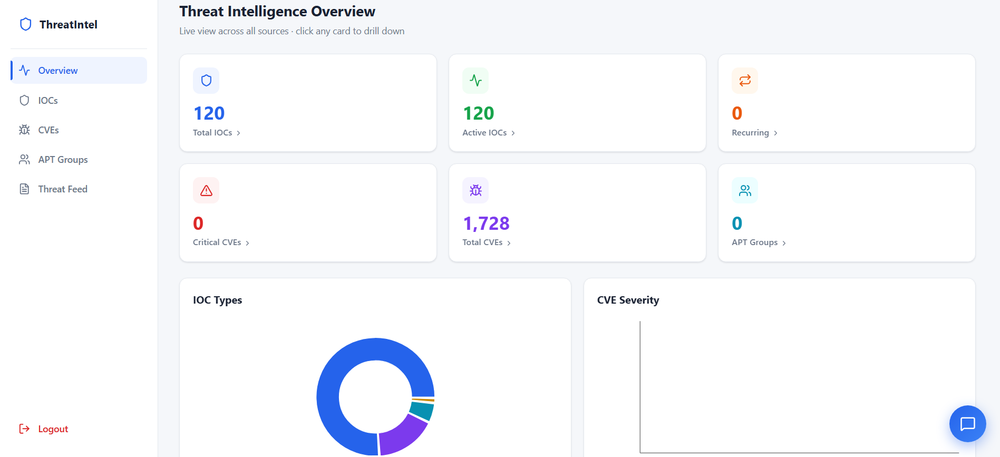
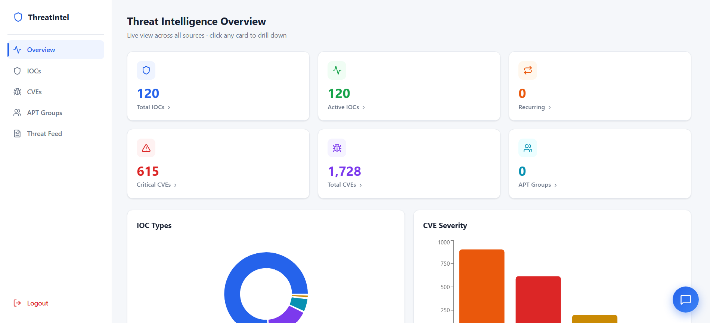
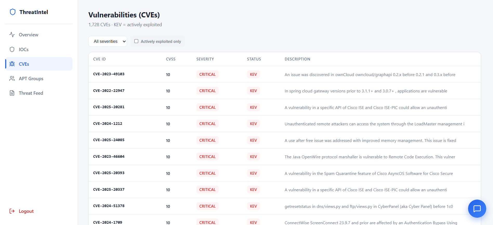
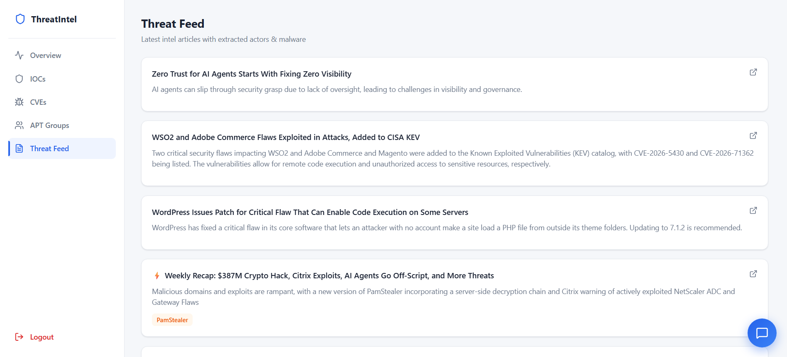
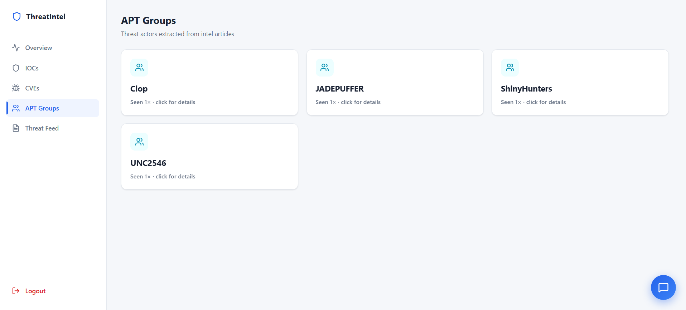

# 🛡️ Custom Threat Intelligence Platform

A full-stack **Threat Intelligence Platform (TIP)** built to ingest, normalize, enrich, analyze, and visualize cyber threat intelligence from multiple public sources.

Built with **Python, FastAPI, PostgreSQL, React, Docker, AbuseIPDB, NVD, CISA KEV, and Ollama**, with a focus on practical SOC and threat-intelligence workflows.

> **Portfolio project focused on Threat Intelligence, IOC investigation, vulnerability intelligence, enrichment, risk scoring, and security operations.**

---

## 🚀 Key Features

* 🌐 Ingests intelligence from multiple public threat feeds
* 🔎 Extracts and tracks **IOCs, CVEs, threat articles, and threat groups**
* 🗃️ Stores normalized intelligence in **PostgreSQL**
* 🛡️ Integrates **CISA KEV** and **NVD** vulnerability intelligence
* 🔍 Enriches IP addresses using **AbuseIPDB**
* 📊 Calculates IOC risk scores using multiple intelligence signals
* ⚠️ Displays CVSS severity and CISA KEV status
* 🤖 Uses **Ollama / Llama 3.2** for LLM-assisted article processing and chatbot functionality
* 🔐 Supports authentication and MFA
* ⚡ Provides a **FastAPI REST API**
* 🖥️ Provides a **React/Vite investigation dashboard**
* 🐳 Runs locally using Docker

---

## 🏗️ Architecture

```text
                    ┌──────────────────────────┐
                    │     Threat Sources       │
                    │                          │
                    │ CISA KEV │ NVD           │
                    │ ThreatFox │ Hacker News   │
                    │ Ransomware.live           │
                    └────────────┬─────────────┘
                                 │
                                 ▼
                    ┌──────────────────────────┐
                    │      Raw Data Layer       │
                    │        raw_items          │
                    └────────────┬─────────────┘
                                 │
                                 ▼
                    ┌──────────────────────────┐
                    │ Processing & Normalization│
                    │                          │
                    │ IOC / CVE / Article      │
                    │ extraction + deduplication│
                    └────────────┬─────────────┘
                                 │
                                 ▼
                    ┌──────────────────────────┐
                    │        PostgreSQL         │
                    │                          │
                    │ IOCs │ CVEs │ Articles   │
                    │ APT Groups │ Enrichment  │
                    └────────────┬─────────────┘
                                 │
              ┌──────────────────┴──────────────────┐
              ▼                                     ▼
    ┌─────────────────────┐              ┌─────────────────────┐
    │ Enrichment & Risk   │              │     FastAPI API     │
    │                     │              │                     │
    │ NVD                 │              │ Authentication      │
    │ AbuseIPDB           │              │ IOC APIs            │
    │ Risk Scoring        │              │ CVE APIs            │
    │ Confidence Signals  │              │ Statistics          │
    └─────────────────────┘              └──────────┬──────────┘
                                                    │
                                                    ▼
                                      ┌─────────────────────────┐
                                      │      React / Vite       │
                                      │                         │
                                      │ Dashboard │ IOCs        │
                                      │ CVEs │ Threat Feed      │
                                      │ APT / Threat Groups     │
                                      └─────────────────────────┘
```

---

## 📊 Project Results

The platform was tested with collected threat-intelligence data and produced:

| Metric                        |      Result |
| ----------------------------- | ----------: |
| CISA KEV vulnerabilities      |   **1,728** |
| NVD-enriched CVEs             |   **1,727** |
| Critical CVEs                 |     **615** |
| High CVEs                     |     **903** |
| Medium CVEs                   |     **201** |
| Low CVEs                      |       **8** |
| Threat intelligence articles  |      **50** |
| Total IOCs                    |     **120** |
| IP addresses                  |      **20** |
| SHA-256 hashes                |       **6** |
| MD5 hashes                    |       **1** |
| AbuseIPDB-enriched IPs        | **20 / 20** |
| Low-risk IOCs                 |     **119** |
| Medium-risk IOCs              |       **1** |
| High-risk IOCs                |       **0** |
| High-confidence threat groups |       **4** |

### Identified Threat Groups

* **Clop**
* **JADEPUFFER**
* **ShinyHunters**
* **UNC2546**

---

## 🖥️ Screenshots

### 🔐 Authentication



Login interface with authentication and MFA support.

### 📊 Main Dashboard



Overview of collected intelligence, vulnerabilities, IOCs, articles, and threat groups.

### 🔎 Enriched Dashboard



Displays processed enrichment and IOC risk-analysis results.

### ⚠️ CVE Vulnerabilities



CVE intelligence with CVSS severity, publication information, and CISA KEV status.

### 📰 Threat Intelligence Feed



Processed threat-intelligence articles collected from external sources.

### 🎯 APT / Threat Groups



High-confidence threat groups identified during article processing.

---

## 🧰 Technology Stack

| Category            | Technologies                                               |
| ------------------- | ---------------------------------------------------------- |
| Backend             | Python, FastAPI, Pydantic, Uvicorn                         |
| Frontend            | React, Vite, JavaScript, HTML, CSS                         |
| Database            | PostgreSQL 16                                              |
| Infrastructure      | Docker, Docker Desktop                                     |
| Threat Intelligence | CISA KEV, NVD, ThreatFox, Ransomware.live, The Hacker News |
| Enrichment          | AbuseIPDB                                                  |
| AI                  | Ollama, Llama 3.2                                          |
| Development         | Windows, PowerShell, Git                                   |

---

## 🔄 Intelligence Processing Pipeline

```text
Threat Feeds
     │
     ▼
Raw Data Ingestion
     │
     ▼
Normalization
     │
     ▼
Deduplication
     │
     ▼
IOC / CVE / Article Processing
     │
     ▼
PostgreSQL
     │
     ├──► NVD Enrichment
     │
     ├──► AbuseIPDB Enrichment
     │
     ├──► Risk Scoring
     │
     └──► Threat Group Identification
              │
              ▼
          FastAPI API
              │
              ▼
        React Dashboard
```

---

## 🎯 IOC Risk Scoring

IOC risk is calculated using multiple intelligence signals rather than a single reputation value.

### Signals include

* AbuseIPDB reputation
* Abuse report count
* IOC confidence
* Threat-intelligence context
* Indicator type
* Enrichment metadata

### Example Result

```text
IOC:              103.102.31.18
Risk Score:       49
AbuseIPDB Score:  25
Reports:          11
Risk Level:       MEDIUM
```

---

## 🔌 API

The backend is exposed through **FastAPI**.

### Example endpoints

```text
POST /login
POST /chat
GET  /stats
GET  /iocs
GET  /iocs/recurring
GET  /ioc/{value}
```

Local Swagger documentation:

```text
http://127.0.0.1:8001/docs
```

---

## 🗄️ Database

PostgreSQL stores the normalized threat-intelligence data.

Main tables:

```text
apt_groups
articles
cves
ioc_enrichment
ioc_sightings
iocs
raw_items
```

The `raw_items` layer preserves ingested intelligence before it is processed into structured entities.

---

## 🔐 Security Considerations

The project includes basic security controls such as:

* Environment-based secret configuration
* `.env` exclusion from Git
* JWT authentication
* MFA support
* Separate database roles
* API authentication
* CORS configuration
* Local-only development services

> **Never commit real API keys, passwords, JWT secrets, MFA secrets, or other credentials.**

---

## ⚙️ Local Setup

### Requirements

* Python 3.12+
* Node.js
* npm
* Docker Desktop
* Git

### Clone

```bash
git clone https://github.com/Vineet-Shrimal/custom-threat-intelligence-platform.git
cd custom-threat-intelligence-platform
```

### Backend

```powershell
cd backend
python -m venv venv
.\venv\Scripts\python.exe -m pip install -r requirements.txt
```

Create `backend/.env` using:

```text
backend/.env.example
```

Then start FastAPI from the project root:

```powershell
.\backend\venv\Scripts\python.exe -m uvicorn backend.api:app --host 127.0.0.1 --port 8001
```

Swagger:

```text
http://127.0.0.1:8001/docs
```

### Frontend

Open a second terminal:

```powershell
cd frontend
npm install
npm.cmd run dev
```

Frontend:

```text
http://localhost:5173
```

> Port `8001` is used by the development environment because port `8000` was occupied by a local Splunk instance.

---

## 📁 Project Structure

```text
custom-threat-intelligence-platform/
│
├── backend/
│   ├── api.py
│   ├── auth.py
│   ├── chatbot.py
│   ├── compute_risk.py
│   ├── processor_articles.py
│   ├── processor_structured.py
│   ├── connector_cisa_kev.py
│   ├── connector_hackernews.py
│   ├── connector_nvd.py
│   ├── connector_rl_iocs.py
│   ├── connector_threatfox.py
│   └── requirements.txt
│
├── frontend/
│   ├── src/
│   ├── public/
│   ├── package.json
│   └── vite.config.*
│
├── docs/
│   ├── 01_cti_login_page.png
│   ├── 02_cti_dashboard.png
│   ├── 03_cti_enriched_dashboard.png
│   ├── 04_cti_cve_vulnerabilities.png
│   ├── 05_cti_threat_feed.png
│   └── 06_cti_apt_groups.png
│
├── ORIGINAL_PROJECT_CREDIT.md
├── README.md
└── .gitignore
```

---

## ⚠️ Known Limitations

* Some threat feeds require API keys or are subject to rate limits.
* Public feed formats may change.
* LLM-based extraction can produce incorrect classifications.
* High-confidence validation rules are used for selected threat-group classifications.
* Shodan integration is optional and was not treated as a verified enrichment result because the configured request returned HTTP 401.
* This is a **portfolio/lab project**, not a production-grade enterprise TIP.

---

## 🎯 Portfolio Focus

This project demonstrates practical exposure to:

**Threat Intelligence · IOC Investigation · Vulnerability Intelligence · CVE/KEV Analysis · IOC Enrichment · Risk Scoring · PostgreSQL · REST APIs · FastAPI · React · Docker · Authentication · MFA · Python Automation · LLM-assisted Security Workflows**

Relevant to:

**SOC Analyst · Cybersecurity Analyst · Threat Intelligence Analyst · Security Operations**
